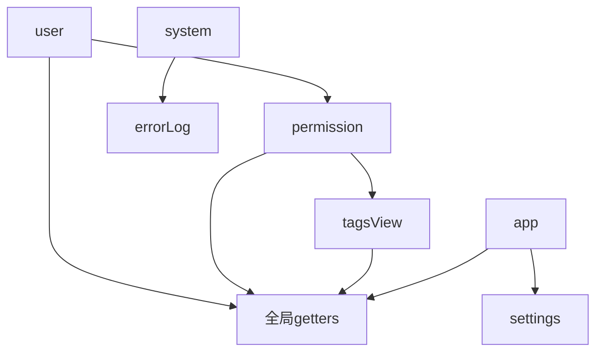

# 任务2：状态管理系统迁移（Vuex → Pinia）

## 任务概述

**目标**：完成状态管理从 Vuex 3.x 到 Pinia 的全面迁移  
**依赖**：任务1（路由系统迁移）完成  
**并行性**：✅ 可与任务3并行进行  
**时间估算**：1.5 周（比原计划增加0.5周，因为状态管理复杂度较高）

## 前置条件检查

```bash
# 确保前置任务已完成
✅ Vue 3 基础环境就绪
✅ Vue Router 4.x 正常工作
✅ TypeScript 配置完成
✅ Vite 构建工具配置完成
```

## 迁移范围分析

### 2.1 现有 Vuex 模块分析

#### 2.1.1 模块复杂度评估

| 模块名称 | 文件大小 | 复杂度 | 迁移优先级 | 主要功能 |
|---------|---------|--------|-----------|----------|
| **user.js** | 3.6KB | ⭐⭐⭐⭐⭐ | 🔴 高 | 用户认证、权限管理 |
| **permission.js** | 4.0KB | ⭐⭐⭐⭐⭐ | 🔴 高 | 路由权限、菜单权限 |
| **tagsView.js** | 4.0KB | ⭐⭐⭐⭐ | 🟡 中 | 标签页管理 |
| **app.js** | 1.2KB | ⭐⭐⭐ | 🟡 中 | 应用全局状态 |
| **settings.js** | 756B | ⭐⭐ | 🟢 低 | 应用设置 |
| **system.js** | 607B | ⭐⭐ | 🟢 低 | 系统信息 |
| **errorLog.js** | 406B | ⭐ | 🟢 低 | 错误日志 |

#### 2.1.2 状态依赖关系分析



**关键依赖关系**：
- `user` → `permission`：用户角色决定权限路由
- `permission` → `tagsView`：权限路由影响标签页
- `app` ↔ `settings`：应用状态与设置相互影响

### 2.2 Pinia 迁移策略设计

#### 2.2.1 Store 架构重新设计

**设计原则**：
1. **单一职责**：每个 store 只负责一个业务领域
2. **组合优于继承**：使用 composables 共享逻辑
3. **类型安全**：完整的 TypeScript 类型支持
4. **性能优化**：按需响应式和计算属性

**新架构设计**：
```
src/stores/
├── index.ts              # Pinia 实例配置
├── types.ts              # 全局类型定义
├── composables/          # 共享逻辑
│   ├── useAuth.ts        # 认证相关逻辑
│   ├── usePermission.ts  # 权限相关逻辑
│   └── useStorage.ts     # 持久化逻辑
└── modules/              # 业务模块
    ├── user.ts           # 用户状态管理
    ├── permission.ts     # 权限状态管理
    ├── tagsView.ts       # 标签页状态管理
    ├── app.ts            # 应用状态管理
    ├── settings.ts       # 设置状态管理
    ├── system.ts         # 系统状态管理
    └── errorLog.ts       # 错误日志状态管理
```

## 详细工作计划

### 阶段1：基础架构搭建（2天）

#### 1.1 Pinia 环境配置
- **Pinia 实例创建**：配置 Pinia 实例和插件
- **类型定义**：建立完整的 TypeScript 类型系统
- **持久化插件**：配置状态持久化策略
- **开发工具集成**：配置 Vue DevTools 支持

#### 1.2 共享逻辑抽取
- **认证逻辑 composable**：抽取通用认证逻辑
- **权限检查 composable**：抽取权限验证逻辑
- **存储管理 composable**：抽取本地存储逻辑
- **API 调用 composable**：抽取通用 API 调用逻辑

#### 1.3 迁移工具准备
- **状态映射工具**：创建 Vuex 到 Pinia 的映射工具
- **测试工具**：准备状态管理测试工具
- **调试工具**：配置状态调试和监控工具

### 阶段2：核心状态模块迁移（4天）

#### 2.1 用户状态管理迁移（1.5天）
**复杂度分析**：
- 7个状态属性：token, name, avatar, introduction, roles, permissions, permisaction
- 6个 mutations：状态更新逻辑
- 6个 actions：异步操作（登录、获取用户信息、登出等）

**迁移重点**：
- **认证流程重构**：
  - 登录状态管理
  - Token 刷新机制
  - 自动登出逻辑
- **用户信息管理**：
  - 用户基本信息存储
  - 头像处理逻辑
  - 角色权限数据结构
- **状态持久化**：
  - Token 本地存储
  - 用户信息缓存策略

**技术考虑**：
- 使用 `defineStore` 的 setup 语法
- 实现响应式的计算属性
- 错误处理和重试机制

#### 2.2 权限状态管理迁移（1.5天）
**复杂度分析**：
- 动态路由生成逻辑
- 菜单权限过滤
- 按钮级权限控制
- 多层级权限验证

**迁移重点**：
- **路由权限管理**：
  - 动态路由生成算法
  - 路由权限验证逻辑
  - 菜单树构建算法
- **权限验证机制**：
  - 页面级权限检查
  - 组件级权限控制
  - 操作级权限验证
- **权限缓存策略**：
  - 权限数据缓存
  - 权限变更响应

**技术考虑**：
- 权限算法优化
- 内存使用优化
- 权限变更的响应式处理

#### 2.3 标签页状态管理迁移（1天）
**复杂度分析**：
- 访问过的视图管理
- 缓存视图管理
- 标签页操作（添加、删除、刷新）

**迁移重点**：
- **标签页生命周期**：
  - 标签页创建逻辑
  - 标签页缓存策略
  - 标签页销毁处理
- **标签页操作**：
  - 关闭单个标签
  - 关闭其他标签
  - 关闭所有标签
  - 刷新标签页
- **路由集成**：
  - 与路由系统的深度集成
  - 路由变化的响应处理

### 阶段3：辅助状态模块迁移（2天）

#### 3.1 应用状态管理迁移
- **侧边栏状态**：展开/收起状态管理
- **设备检测**：移动端/桌面端适配
- **主题设置**：主题切换和持久化
- **语言设置**：国际化状态管理

#### 3.2 系统状态管理迁移
- **系统信息**：版本信息、配置信息
- **错误日志**：错误收集和展示
- **性能监控**：性能数据收集

### 阶段4：组件集成和测试（2天）

#### 4.1 组件状态使用更新
- **Options API → Composition API**：
  - `this.$store` → `useStore()`
  - `mapState` → `storeToRefs()`
  - `mapActions` → 直接调用 store 方法
- **响应式处理**：
  - 确保状态变化的响应式
  - 避免响应式丢失问题
- **类型安全**：
  - 完整的 TypeScript 类型支持
  - 编译时类型检查

#### 4.2 状态管理测试
- **单元测试**：每个 store 的独立测试
- **集成测试**：store 之间的交互测试
- **端到端测试**：完整业务流程测试

## 关键技术决策

### 3.1 Store 定义方式选择

**选择 Setup Store 语法**：
```typescript
// 推荐：Setup Store 语法
export const useUserStore = defineStore('user', () => {
  // state
  const token = ref<string>('')
  const userInfo = ref<UserInfo | null>(null)
  
  // getters
  const isLoggedIn = computed(() => !!token.value)
  const hasRole = computed(() => (role: string) => 
    userInfo.value?.roles.includes(role) ?? false
  )
  
  // actions
  const login = async (credentials: LoginCredentials) => {
    // 登录逻辑
  }
  
  return {
    token,
    userInfo,
    isLoggedIn,
    hasRole,
    login
  }
})
```

**优势**：
- 更好的 TypeScript 支持
- 更灵活的组合逻辑
- 更接近 Composition API 风格

### 3.2 状态持久化策略

**分层持久化策略**：
1. **敏感数据**：仅内存存储（用户权限详情）
2. **认证数据**：localStorage（token、基本用户信息）
3. **用户偏好**：localStorage（主题、语言设置）
4. **临时数据**：sessionStorage（标签页状态）

### 3.3 性能优化策略

1. **按需响应式**：只对必要的状态使用响应式
2. **计算属性缓存**：合理使用 computed 缓存计算结果
3. **状态分割**：避免大对象的整体响应式
4. **懒加载**：非关键状态的懒加载

## 迁移检查清单

### 基础配置
- [ ] Pinia 实例配置完成
- [ ] TypeScript 类型定义完整
- [ ] 持久化插件配置
- [ ] 开发工具集成

### 状态模块迁移
- [ ] 用户状态管理迁移完成
- [ ] 权限状态管理迁移完成
- [ ] 标签页状态管理迁移完成
- [ ] 应用状态管理迁移完成
- [ ] 系统状态管理迁移完成

### 组件集成
- [ ] 所有组件状态调用更新
- [ ] 响应式处理正确
- [ ] 类型检查通过
- [ ] 性能测试通过

### 功能验证
- [ ] 用户登录/登出功能正常
- [ ] 权限控制功能正常
- [ ] 标签页操作功能正常
- [ ] 应用设置功能正常
- [ ] 状态持久化功能正常

## 风险控制和应对策略

### 主要风险点
1. **状态响应式丢失**：迁移过程中可能丢失响应式
2. **权限逻辑错误**：复杂的权限逻辑可能出错
3. **性能回归**：状态管理性能可能下降
4. **类型安全问题**：TypeScript 类型可能不完整

### 应对策略
1. **渐进式迁移**：按模块逐步迁移，降低风险
2. **完整测试覆盖**：确保每个功能都有测试
3. **性能监控**：持续监控状态管理性能
4. **类型检查**：严格的 TypeScript 类型检查

### 功能测试用例
1. **用户认证流程**：登录、获取用户信息、登出
2. **权限验证流程**：路由权限、菜单权限、按钮权限
3. **标签页管理**：添加、删除、刷新标签页
4. **状态持久化**：刷新页面后状态恢复
5. **错误处理**：网络错误、认证失败等异常情况

## 完成标准

### 功能完整性
- ✅ 所有 Vuex 功能迁移到 Pinia
- ✅ 用户认证流程正常
- ✅ 权限控制功能正常
- ✅ 标签页管理功能正常
- ✅ 应用设置功能正常

### 技术指标
- ✅ TypeScript 类型检查通过
- ✅ 单元测试覆盖率 ≥ 90%
- ✅ 集成测试通过
- ✅ 性能不低于迁移前
- ✅ 内存使用优化

### 开发体验
- ✅ 完整的类型提示
- ✅ 良好的开发工具支持
- ✅ 清晰的状态管理结构
- ✅ 易于维护和扩展

## 后续优化方向

1. **状态管理模式优化**：探索更好的状态管理模式
2. **性能持续优化**：基于使用数据进行性能优化
3. **开发工具增强**：开发更好的调试和监控工具
4. **状态管理最佳实践**：建立团队的状态管理规范 